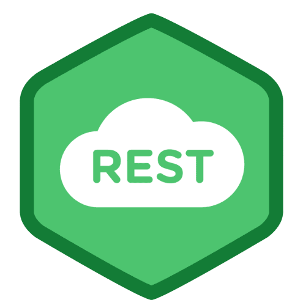

<h1 align="center">Olá 👋, me chamo Marcos Vinícius de Almeida Mendonça</h1>
<h3 align="center">Desenvolvedor apaixonado, sempre em busca de novos desafios e conhecimentos</h3>
 

> Bacharel em Sistemas de Informação pela FIPP/Unoeste.  
> Atualmente, trabalho como Analista de Sistemas na [MATERA Systems](https://www.matera.com)

<h2>Contato</h2>

&nbsp;&nbsp;
&nbsp;

<h2>Linguagens e tecnologias</h2>

 
  

  &nbsp;&nbsp;

  &nbsp;

   

   

  

  

   

  &nbsp;

  &nbsp;

  &nbsp;

  &nbsp;

  
  
  

  

  
  
   &nbsp;
  
   &nbsp;
  
   
  
   &nbsp;
  
   &nbsp;

  &nbsp;

  &nbsp;

  &nbsp;

    

<h2>Portfólio</h2>

  <pre>
               <b>DSVendas                              Projeto 2                              Projeto 3</b>
             
              <b>Projeto 4                             Projeto 5                             Projeto 6</b>
            
  </pre>

