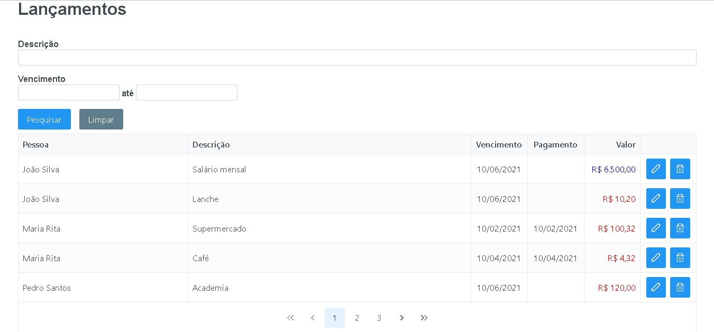
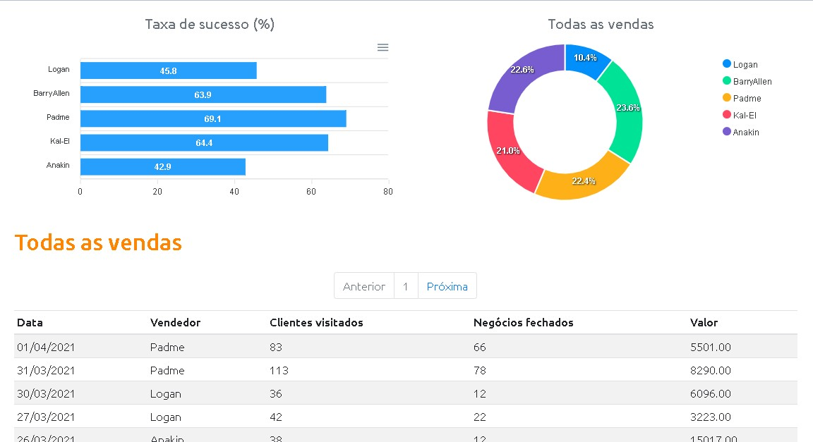
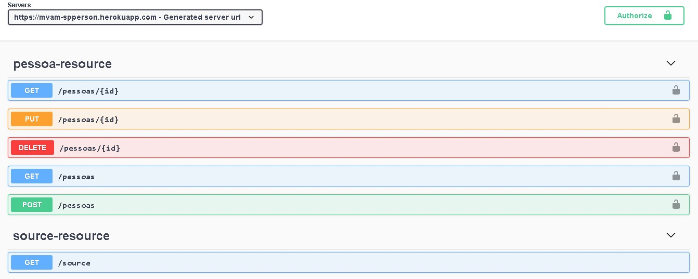

<h1 align="center">Olá 👋, me chamo Marcos Vinícius de Almeida Mendonça</h1>
<h3 align="center">Desenvolvedor apaixonado, sempre em busca de novos desafios e conhecimentos</h3>
 

> Bacharel em Sistemas de Informação pela FIPP/Unoeste.  
> Atualmente, trabalho como Analista de Sistemas na [MATERA Systems](https://www.matera.com)

<h2>Contato</h2>

&nbsp;&nbsp;&nbsp;
&nbsp;&nbsp;

<h2>Habilidades</h2>

 
  

  

  

  

  

  

  

  

  

    

    

  

  

  

  

  

  

  

  

  

  

  

  

  

  

<h2>Portfólio</h2>

  <a href="https://mvam-algamoney.netlify.app/" title="AlgaMoney &#13;Aplicação para controle financeiro" target="_blank">
    <kbd></kbd>
  </a>&nbsp;&nbsp;&nbsp;&nbsp;&nbsp;&nbsp;&nbsp;&nbsp;&nbsp;&nbsp;
  
  <a href="https://mvam-dsvendas.netlify.app/" title="DSVendas &#13;Dashboard de vendas" target="_blank">
    <kbd></kbd>
  </a>&nbsp;&nbsp;&nbsp;&nbsp;&nbsp;&nbsp;&nbsp;&nbsp;&nbsp;&nbsp;
  
  <a href="https://mvam-spperson.herokuapp.com/swagger-ui/index.html?url=/api-docs" title="SPPerson &#13;API REST para cadastro de pessoas" target="_blank">
    <kbd></kbd>
  </a>&nbsp;&nbsp;&nbsp;&nbsp;&nbsp;&nbsp;&nbsp;&nbsp;&nbsp;&nbsp;

